 

<samp>Product Designer with a background in Computer Engineering. 
Building at the intersection of design tools and code.</samp>

 

<samp>Currently at <strong>noon</strong> — improving how designers and engineers collaborate.</samp>

 

<samp><strong>Working with</strong></samp>

<samp>

</samp>

 
 

<samp><strong>Previously</strong></samp>

<samp>

</samp>

 
 

<samp><a href="https://yoursite.com">Portfolio</a> · <a href="https://linkedin.com/in/khaaledashraaf">LinkedIn</a></samp>
